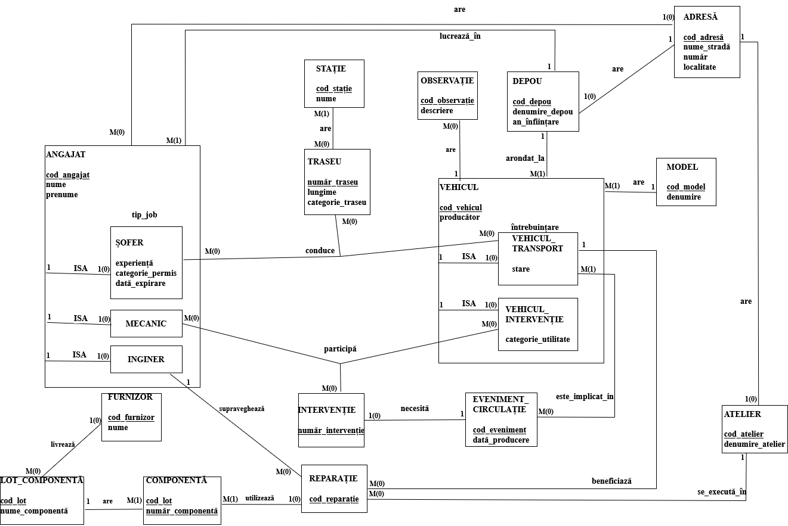
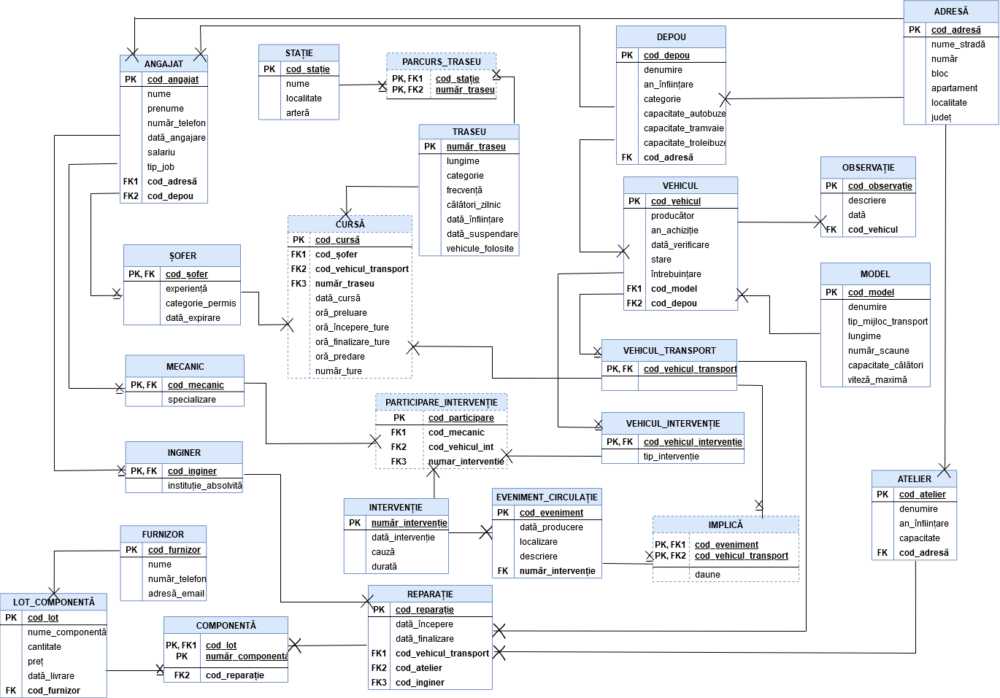

### Management of a Public Transit System

The implementation of a relational database using Oracle 19c, which models the various activities of a public transit operator. I was mainly concerned with the management of the vehicles, the routes they run on, the repairs they undergo and the traffic collisions they were involved in. 

**Entity-Relationship Diagram**

**Conceptual Model**

